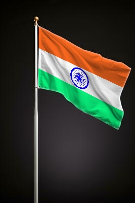
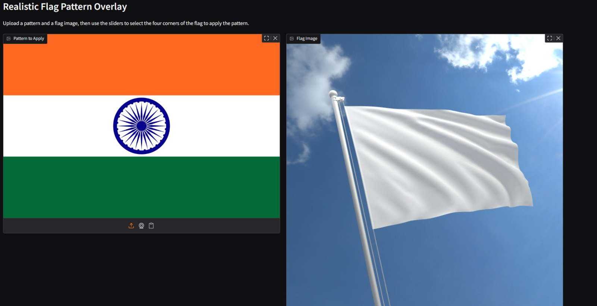

# Realistic-Flag-Pattern-Overlay-Using-OpenCV
This project provides two Python scripts for realistically applying a pattern or texture onto a flag image, taking into account its perspective and folds. It effectively simulates mapping a pattern onto a curved surface, such as a flag, to produce photorealistic results. The project leverages OpenCV for image processing and offers both a command-line interface and a user-friendly web application.

---

## Project Overview
The core idea is to seamlessly blend a given Pattern.png onto a Flag.png (ideally a white or solid-colored flag), making the pattern appear as if it's naturally draped over the flag's contours. This is achieved through perspective warping, advanced masking, and luminosity blending techniques.

---

## Scripts

### 1. `script.py` – Command-Line Interface

This is the foundational script that performs the image processing.

**Key Features:**
- **Interactive Point Selection:** Click manually on the four corners of the flag in an OpenCV window to define the mapping area.
- **Robust Flag Masking:** Uses GrabCut, morphological operations, and Gaussian blur to extract a soft, accurate flag mask for clean blending.
- **Perspective Warping:** Warps the `Pattern.png` to match the selected flag region.
- **Luminosity Blending:** Transfers shadows and highlights from the original flag to the warped pattern for realistic folds and lighting.
- **Output:** Saves and displays the final image as `Output.jpg`.

**How to Use:**
1. Place `script.py`, `Pattern.png`, and `Flag.png` in the same directory.
2. Run the script:
   ```bash
   python script.py
   ```
3. Follow the on-screen instructions to click the four corners of the flag (Top-Left, Top-Right, Bottom-Right, Bottom-Left).




### 2. `app.py` – Gradio Web Application

This script provides a web interface for easier interaction using the Gradio library.

**Key Features:**
- **Web-based GUI:** Upload images and control the process via sliders and live preview.
- **Image Uploads:** Upload Pattern.png and Flag.png directly through the interface.
- **Slider-based Point Adjustment:** Precisely control the X/Y coordinates of the flag’s corners.
- **Live Point Preview:** Real-time visual feedback as you adjust corner points.
- **Example Coordinates:** Includes pre-filled coordinates to quickly test the application.

**How to Use:**
1. Install Gradio:
```bash
pip install gradio
```
2. Place app.py in any directory.
3. Run the script:
```bash
python app.py
```
4. Open the displayed URL in your browser (e.g., http://127.0.0.1:7860).
5. Upload your images, adjust the sliders, and click "Apply Pattern to Flag".



---

## Prerequisites
- Python 3.x
- OpenCV
- NumPy
- Gradio

---

## Cloning the Repository
To clone the repository and get started:
```bash
git clone https://github.com/GayathriDeviRV/Realistic-Flag-Pattern-Overlay-Using-OpenCV.git
cd Realistic-Flag-Pattern-Overlay-Using-OpenCV
```

---

